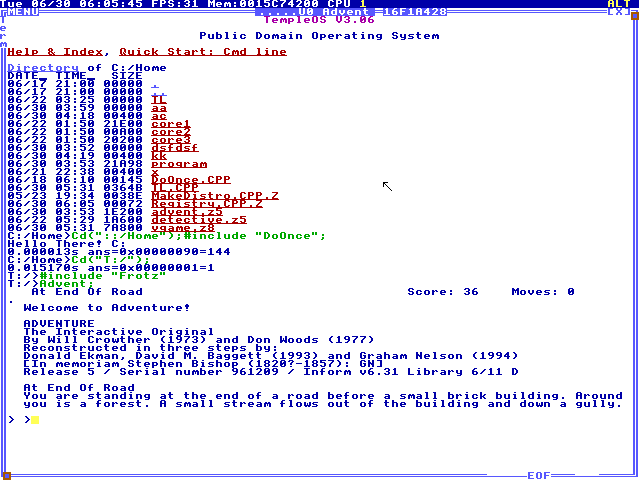

This is a port of "frotz" for TempleOS. This allows most Z-machine games
to be played on TempleOS.

* frotz       https://github.com/DavidGriffith/frotz
* TempleOS    http://www.templeos.org/



See also: http://blog.jwhitham.org/2015/07/porting-third-party-programs-to-templeos.html

# Instructions

1. download the "demo.iso" CDROM image
    https://raw.githubusercontent.com/jwhitham/frotz/master/demo.iso

2. Boot TempleOS and insert the CD image, e.g. by burning it to disc,
or (more likely) using the "Choose a CD/DVD file" feature of your
virtual machine software.

3. Use the mouse to increase the size of the terminal window to the full 
80 columns provided by TempleOS.

4. Switch to the CDROM root directory, load the loader, and start the game:
```
    Cd("T:/");
    #include "Frotz";
    Advent;
```

This will run a Z-machine port of Adventure, viz.

    Welcome to Adventure!

    ADVENTURE
    The Interactive Original
    By Will Crowther (1973) and Don Woods (1977)
    Reconstructed in three steps by:
    Donald Ekman, David M. Baggett (1993) and Graham Nelson (1994)
    [In memoriam Stephen Bishop (1820?-1857): GN]
    Release 5 / Serial number 961209 / Inform v6.31 Library 6/11 D

    At End Of Road
    You are standing at the end of a road before a small brick building.
    Around you is a forest. A small stream flows out of the building and
    down a gully.

    >

which you can then play in the usual text adventure way, e.g. "east",
"get food", "eat food", etc.

If you wish to save or restore, specify a location on your hard disk,
e.g. "c:/savegame".

You can load other games, some others are included in the CD image. For example:
    
    Frotz ("detective.z5");
    Frotz ("vgame.z8");

These are favourites of mine, for various reasons. You can download
more from http://ifdb.tads.org/ which has a rating system. vgame 
is excellent, detective is... a classic, of a sort.


# This isn't really a port

Unfortunately, TempleOS has neither a C compiler nor a C standard library
(LibC). This makes it difficult to port any software to TempleOS, as 
this software would have to be entirely rewritten in the native 
language, HolyC. While automatic C -> HolyC translation might be possible,
the lack of LibC is still a difficulty, because C programs expect 
functions like "memcpy" and "printf" to exist. TempleOS has "MemCpy", 
and you can print text with a printf-like mechanism.  But sometimes, 
there is no equivalent. For instance, while "FOpen" is similar
to "fopen", there is no "fwrite", "fputs" or "fread". File access on
TempleOS is block-based and the API is quite different to the C standard.

"frotz" is written in C, and of course, it uses LibC functions.
It can't be compiled as HolyC.

However, TempleOS does have a language in common with Linux, namely
x86_64 machine instructions. 

I decided that the quickest way to port "frotz" to TempleOS was to
compile it on Linux, statically linked against LibC (well, uClibc),
and then write a loader for TempleOS which starts the program and
translates (some) Linux system calls to TempleOS system calls.

It worked.

This approach can be used for any C program, including C compilers.
The limitations are:
* system calls used by the C program must be supported by the loader;
* the C program must be statically linked, there can be no dynamic libraries;
* no multithreading;
* the program must use entirely position-independent code;
* the program can't use SSE2 instructions, TempleOS doesn't support them;
* the size of the heap is restricted by the loader.

This is not a port. It's more like an application compatibility layer.


# Why?

Because.

http://www.smbc-comics.com/index.php?db=comics&id=2158#comic

TempleOS is not an alien operating system, but it is one of only a few
OS designs made since 1980 that are not based on C. Most operating system
designers would start with a C compiler and build their kernel using it.
TempleOS's designer started by designing a language, writing a compiler,
and then a kernel and a user interface. This is an eccentric, otherworldly
approach to OS design.

Porting software to TempleOS is a challenge that goes beyond the usual
approaches of recompiling the program and translating some 
platform-dependent functions.

This small project was filled with reminders of the extent to which we
depend on software infrastructure, i.e. tools. Not just the C compiler,
but also effective debuggers, editors and version control systems.
TempleOS hits the reset button on all of these things: programmers' tools
are all different. I depend so heavily on the tools that I normally use.
It's a real culture shock to work in an environment where none of
them are available. But that's why it's a challenge.


# How?

Instead of executing the "syscall" instruction, my modified version 
of uClibc jumps to a system call handler function, TL_Syscall, which
processes the system call using native TempleOS library calls. This
involves translating the calling convention from Linux to TempleOS.
This translation is performed in assembly code.

The "exit" system call works like the C API function "longjmp", i.e.
it restores registers including the stack pointer, unwinding execution
to some point reached earlier in the call tree. The code for doing
the longjmp-like operation is in TL_Restore_Point. The corresponding
setjmp forms part of the launcher (TL_Launch). This technique is
necessary because TempleOS programs are expected to return to the shell.
They can't simply abandon execution and expect the OS to clean up.

The program binary "frotz.prg" has to be compiled as position-independent
code because TempleOS does not use virtual memory features. All programs
share the same linear address space. GCC has no difficulty producing
position-independent code and the x86_64 instruction set supports it
efficiently, e.g. with PC-relative jumps and calls. However, I have not
yet found a good way to make the compiler generate position-independent
code for global data structures, e.g. "stdout", when those structures
themselves contain pointers. So I compute the required relocations
by the crude trick of linking the program twice at different base
offsets, and then scanning the resulting binary to see where relocations
will be required. This is done in loader/make_program.py.


# Rebuilding

Full source code is available from https://github.com/jwhitham/frotz -
run the "frotz.sh" script on Linux to rebuild Frotz, uClibc, and the
"frotz.prg" program file.


